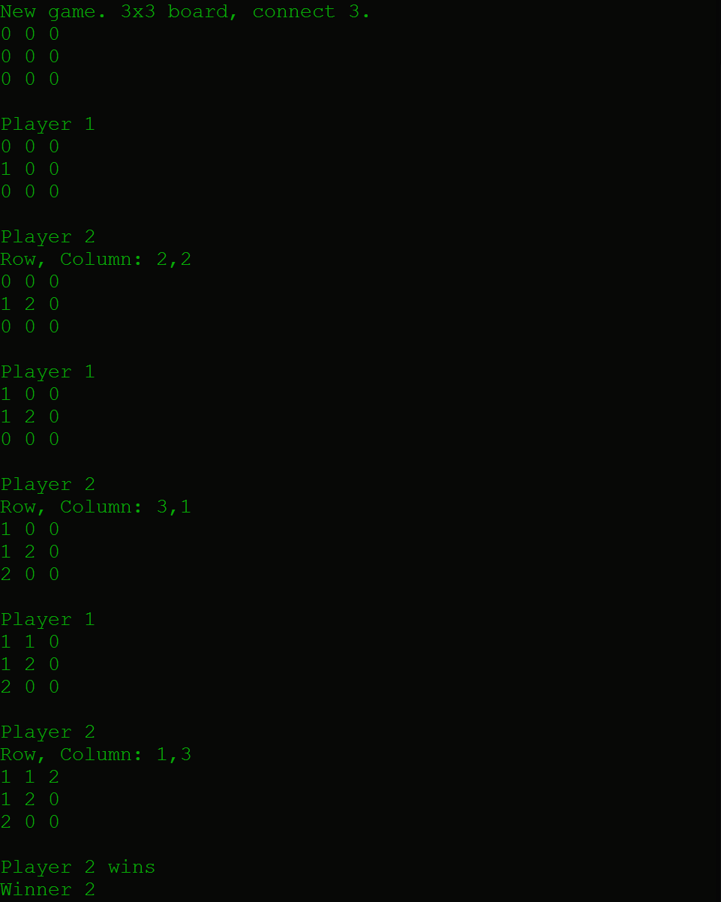
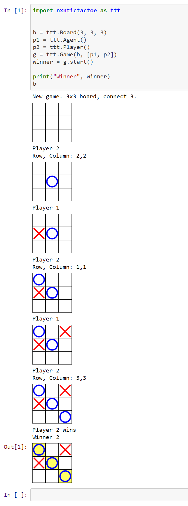
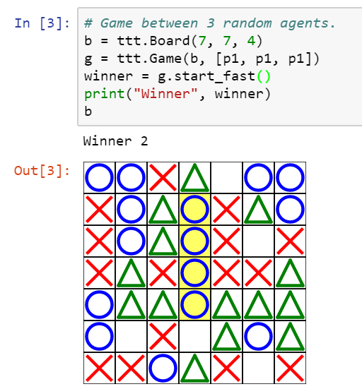

NxN Tic Tac Toe
===============

Pure Python library that implements the logic of Tic-Tac-Toe on boards of any size and with any number of players. In addition, you can also change the number of consecutive pieces to be connected.


The library contains a way to graphically visualize the state of the board that integrates seamlessly with Jupyter Notebooks ([more screenshots below](https://github.com/guiferviz/NxN-Tic-Tac-Toe#screenshots)).

</img>

Install as a Python package
---------------------------

Install the package with:

    python setup.py install


Install for development
-----------------------

Install the package with:

    python setup.py develop


Sample code
-----------

```python
import nxntictactoe as ttt

# Create board.
rows = 3
columns = 3
connect = 3
b = ttt.Board(rows, columns, connect)
# Random player.
p1 = ttt.Agent()
# Player that ask the user the next movement.
p2 = ttt.Player()
# Create a game with that board and those 2 players.
g = ttt.Game(b, [p1, p2])
# Run the game in verbose mode.
winner = g.start()

print("Winner", winner)
```

More code examples in the [sample notebook](https://github.com/guiferviz/NxN-Tic-Tac-Toe/blob/master/examples/JupyterNotebookExample.ipynb).


Screenshots
-----------

Execution of the sample code in a terminal:

</img>

Execution of the sample code in a notebook:

</img>

Another example with 3 random players.

</img>
